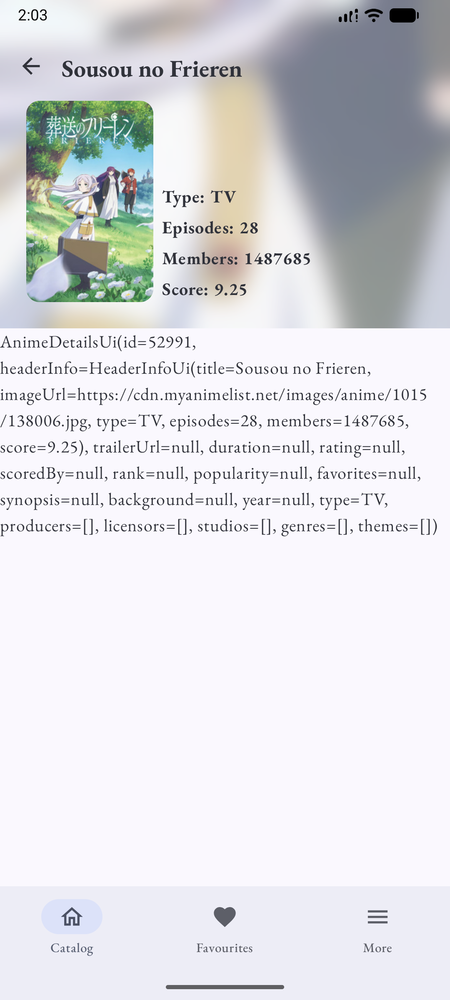
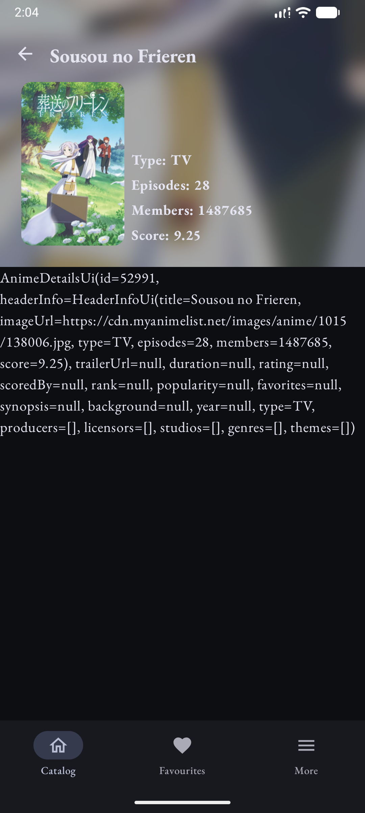

# Anime & Manga 

## ⭐ Engineering Highlights

- Multi-module architecture
- Clean Architecture & MVI
- Optimized application startup with lightweight dependency initialization
- Dependency Injection with Dagger 2
- Centralized runtime configuration for caching and paging using Paging 3 & RemoteMediator 
- Offline-first data layer with Room
- Persistent application configuration using DataStore Preferences
- Build variants with environment-specific cache policies (1 minute for Internal, 1 day for Production)
- Separate Internal and Production configurations
- Configurable application behavior without code changes
- Material 3 with dynamic theming & contrast mode
- Adaptive NavigationSuiteScaffold (Navigation Bar / Navigation Rail) using Navigation 3
- Build flavors
- GitHub Actions CI/CD

## ✨ Features

- Browse anime catalog
- Infinite scrolling
- Fast loading with offline cache
- Light and Dark themes
- Adaptive navigation for different screen sizes
- Material 3 UI

## 🔑 API Key

This project requires a MyAnimeList API key to get data.

You can obtain your API key here:
- [API key help](https://help.myanimelist.net/hc/en-us/articles/900003108823-API)
  
and add your API key to `local.properties` as `MY_ANIME_LIST_CLIENT_ID=your_api_key` or gradle params as `-PMY_ANIME_LIST_CLIENT_ID=your_api_key` 
  
*The key is stored locally and is not included in the repository.*

## 🛠 Tech Stack

| Category | Technologies |
|----------|--------------|
| Language | Kotlin |
| UI | Jetpack Compose, Material 3 |
| Architecture | MVI, Clean Architecture, Multi-module |
| Dependency Injection | Dagger 2 |
| Asynchronous | Kotlin Coroutines, Flow |
| Networking | Retrofit, Kotlin Serialization |
| Local Storage | Room, DataStore Preferences |
| Pagination | Paging 3 |
| Navigation | Navigation 3 |
| Build | Gradle, Version Catalog |
| CI/CD | GitHub Actions |

## 🏗 Architecture
🚧 **Description & diagram in Progress**

The application follows **Clean Architecture** with a **multi-module** structure and **MVI** presentation layer.

  

## 🎥 App Demo

🚧 **Work in Progress**

The current focus of this project is architecture, scalability, and production-ready engineering practices. The UI will continue to evolve alongside new features.

- Placeholders are shown while images are loading
- Demo of the current state of AnimeDetailsScreen

| Catalog | Details (current state)                                                                                 |
|---------|---------------------------------------------------------------------------------------------------------|
|  |  |

| Theme | Catalog | Details                                                          | Settings |
|---------|---------|------------------------------------------------------------------|--------|
| Light |  |  | ^_^__/ |
| Dark |  |  | ^_^__/ |

## 🗺 Roadmap

### Application

- [x] Material 3 UI
- [x] Anime catalog (first version)
- [ ] **Anime catalog (production version)**
- [ ] **Anime catalog filters**
- [ ] Manga catalog (production version)
- [ ] Manga catalog filters
- [ ] Details screen
- [ ] Favorites
- [ ] Search by title
- [ ] Settings
- [ ] Accessibility improvements (TalkBack)
- [ ] Localization

### Engineering

- [x] Multi-module architecture
- [x] Clean Architecture & MVI
- [x] Adaptive Navigation (Navigation 3)
- [x] Offline-first data layer
- [x] Paging 3 & RemoteMediator
- [x] DataStore Preferences
- [x] GitHub Actions CI
- [ ] GitHub Actions CI improvements
- [ ] Screenshot tests
- [ ] Unit tests
- [ ] UI tests
- [ ] Firebase Remote Config
- [ ] Tablet layout improvements

## 📄 License

This project is licensed under the terms described in the [LICENSE](LICENSE) file.

## 🙏 Acknowledgements

Special thanks to:

- **MyAnimeList API** for providing stable data and beautiful images.
- **Jikan API** for the excellent public API.
- **Copilot** & **ChatGPT** for creating the project's artwork.
